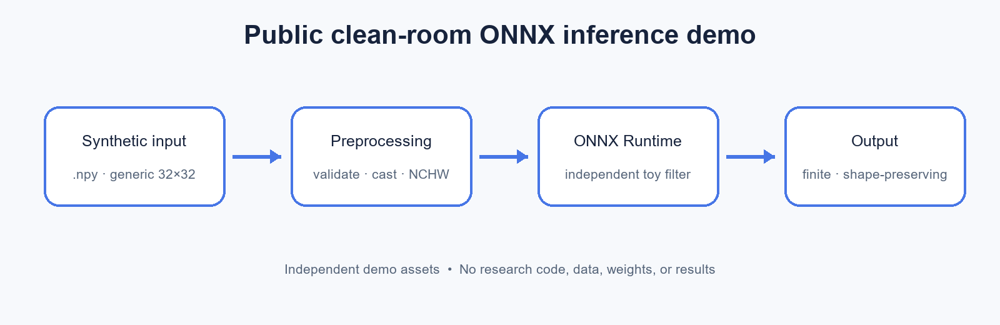

# Denoising Model Experiments

> **Note:** This repository is a sanitized, clean-room portfolio companion to an ongoing research project. It demonstrates a generic inference workflow only. Non-public research code, datasets, trained weights, model architecture details, training recipes, and unpublished results are intentionally omitted. The demo code and synthetic assets were independently created and are not the original research implementation or evaluated model.

This public demo shows a small CPU inference path: validate a synthetic 2D array, convert it to NCHW `float32`, run a generic ONNX averaging filter, and save the result. The associated research explores Autoencoder, PDPM, and Transformer model families; those implementations and results are not included here.

## Architecture



Use Python 3.11 or newer in an activated virtual environment.

## Quick start

```console
python -m pip install -r requirements.txt
python examples/build_toy_model.py
python src/inference_demo.py --input examples/synthetic_input.npy --model examples/toy_denoiser.onnx
python -m unittest discover -s tests -v
```

The builder deterministically recreates `examples/synthetic_input.npy` and writes `examples/toy_denoiser.onnx`. Inference writes `examples/output.npy`. Generated model and output files are ignored by Git.

The CLI is intended only for the toy model generated by this repository. Do not load untrusted ONNX files.

## Scope

This is an independently written engineering example, not a training or benchmarking repository. The included ONNX graph is only a transparent 3×3 averaging filter and is not an approximation of a research model.
